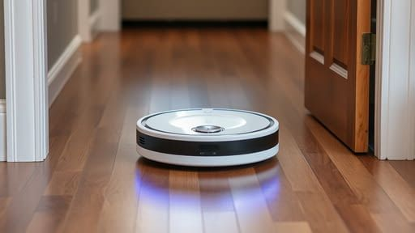
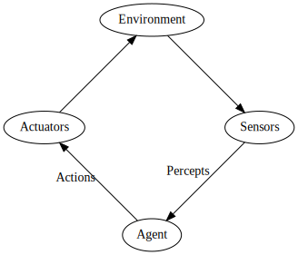

Vacuum
======

This lab provides the opportunity to create an automous agent to vacuum virtual houses.

Task
----

Your task is to implement the vacuuming agent such that it is able to successfully vacuum at least houses 0 through 4. Additional houses are provided for an extra challenge and to better measure agent performance in complex environments.

Percepts and Actions
--------------------

The vacuum `agent` process data from sensors (`percepts`) and uses this sensor data to select a valid `action`. The environment then updates based on the `action` and new `percepts` are returned from sensors so the agent can make its next decision.

Handout Code
------------

Handout code [vacuum.py](vacuum.py) is provided and must be used as a starting point for this assignment. Your task is to provide an implementation for the `agent` function.

Resource
--------

- [PY4E Chapters 2 through 10](https://www.py4e.com/html3/)